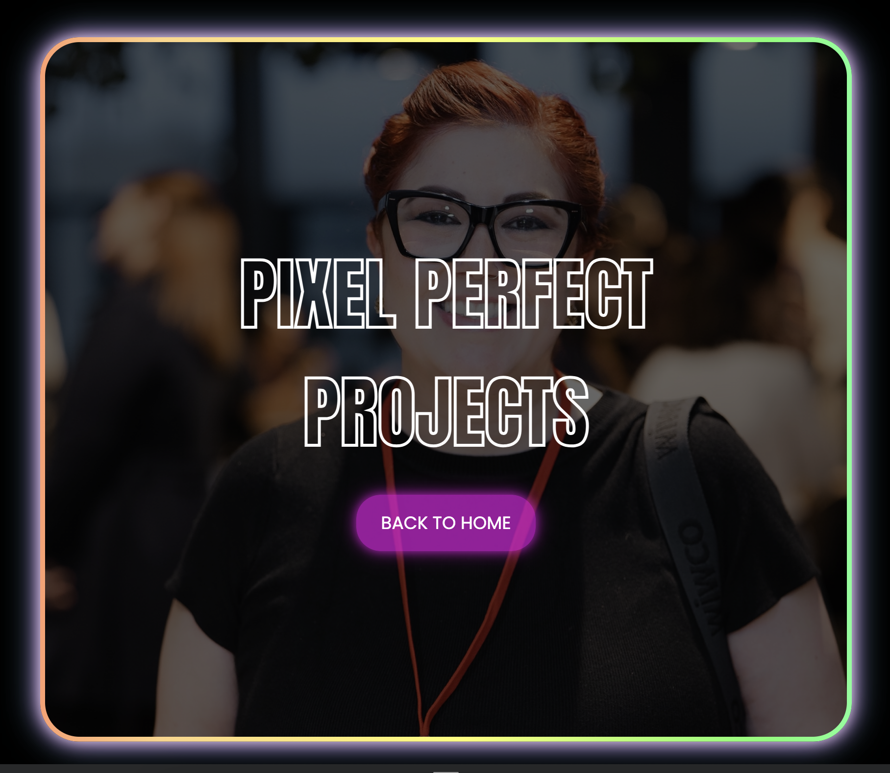
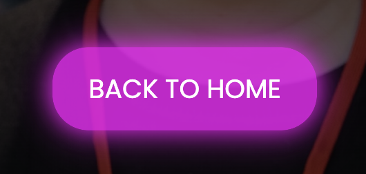

# Pixels by Blair

​
[Check out my portfolio!](https://pixelsbyblair.github.io/)
​

## Project Requirements

### Content

My profile picture was chosen, because it's professional, yet still shows my personality, and I believe that should shine through with any porfolio to reveal more character. Keeping this in mind, my biography was also written in a way the outlines my profressional and tertiary experience, yet also adds some sparkle at the end, with a few insights into what my life is like when I'm away from my computer. 
For my projects section, the digital illustration image is a creation of my own, but for photgraphy and UI/UX I've used placeholder images for now. Once I have created a stronger portfolio, my plan is to create additional pages, which each showcase these three aspects of my portfolio. 
I can honestly say that I'm not entirely happy with how my profile picture was created. What's displayed now is what I orginally created, but the plan was to move the text content to the left of the section and edit the profile picture to be position to the right side of the content, so it was more easily visible. 
With my links to external sites, I found and adapted icons to better suit my colour palette, which offer consistency in design.

- [x] At least one profile picture
- [x] Biography (at least 100 words)
- [x] "Projects" section
- [x] Links to external sites, e.g. GitHub and LinkedIn.
      ​

### Technical

I've created two pages - a landing page, and a page of my projects, with the idea to expand these pages for different types of projects, to additional landing pages. 
Although I am happy with my overall efforts, I feel that I have not achieved a standard I would like. This has been a real learning experience for me - and I feel this is a great opportunity for me to highlight the areas of which I need to build my skills upon and acknowledge what worked, and what could use improvement. 
My social cards are entirely responsive from desktop to mobile, however after many attempts I stuggle to make my hero section responsive, with the correct padding on mobile, and also text and button being cut off on mobile devices. This is far from ideal, and I'll continue to work and grow on this aspect of coding so that I can become more efficient and develop a better understanding of break points and media queries. 
While I did code the project, with my own two hands, in the final step I popped my code into chatGPT at the end to try and fix this responsive error, but I could not fix the solution, and broke my code, which I then had to fix (lesson learnt for using chat GPT - even if it is to solve a problem). It is a massive goal of mine to now master responsive design, as I know it's best practice to start mobile first in mind. 
I'm very aware of my strengths and weaknesses now and plan to work on those aspects moving forward so I can reach the level that I want to be at moving forward 
My design descions were based on a "Tokyo neon nights" vibe, with insipration pulled from video games, art work and other portfolio examples online. 
Through the assistance of my mentors and fellow cohort members, deploying on github pages was a breeze and something I am now very comfortable with. I created addition branches to work on within Git, I do feel as though this is something that I could also develop a greater understanding of, so that I am more comfortable with the process. 
Although I have used semantic HTML, I could be better at this when applying nav and footer elements into future projects.
This project has taught me a great deal - highlighting what I'm capable of, and getting excited about seeing my code turned into beatuiful things, but also determined and psyched to level up my skills on areas where I need to improve.

- [x] At least 2 web pages.
- [x] Version controlled with Git
- [x] Deployed on GitHub pages.
- [x] Implements responsive design principles.
- [x] Uses semantic HTML.

### Bonus (optional)

I was determined to add a few interactive elements to the page. I do love the action of buttons, with change in colour transparency and a slow fade in for buttons to grow. My favourite element would be the transition rainbow border of the hero section. 
I set minimum VH height for the hero section too, so that it was clearly visible on desktop and mobile, appearing how I planned. At this stage I haven't included ay javascript, but plan to in the future.

- [x] Different styles for active, hover and focus states.
- [-] Include JavaScript to add some dynamic elements to your site. (Extra tricky!)
  ​

### Screenshots

#### Responsive on mobile, desktop and tablet

#### Responsivness of hero module

#### Entrance Animation/interaction on buttons with hover, from lower opacity, strong colour, border blur and grow on hover

